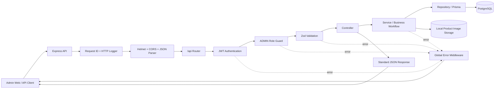
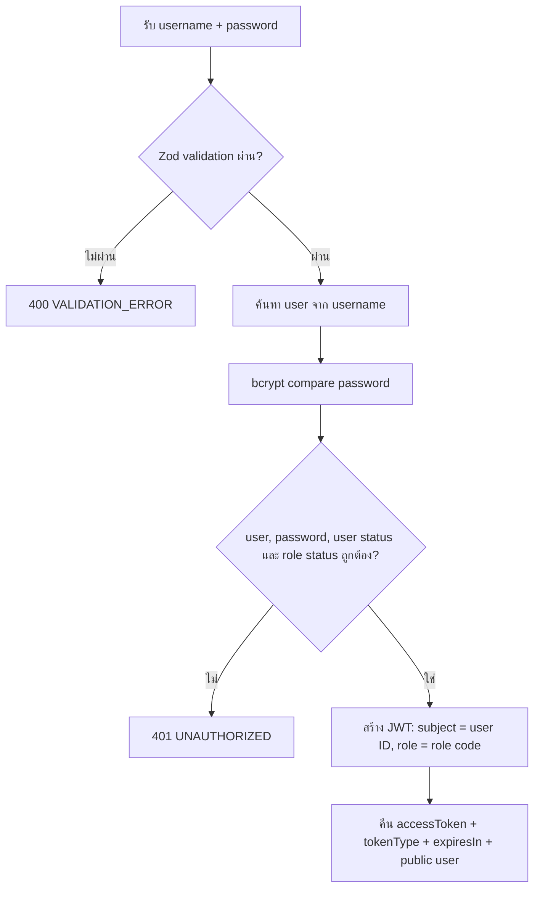
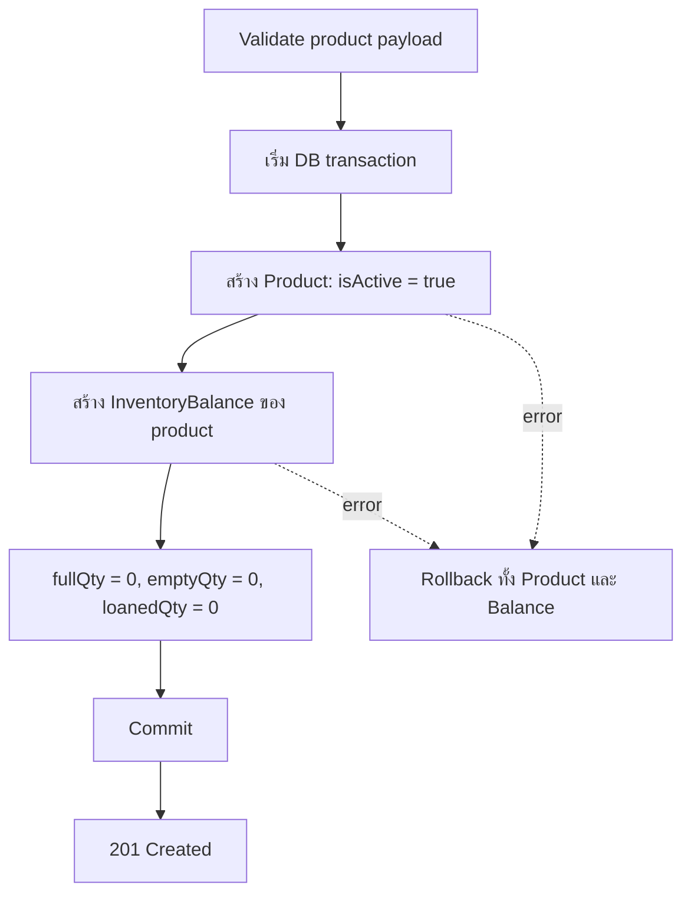
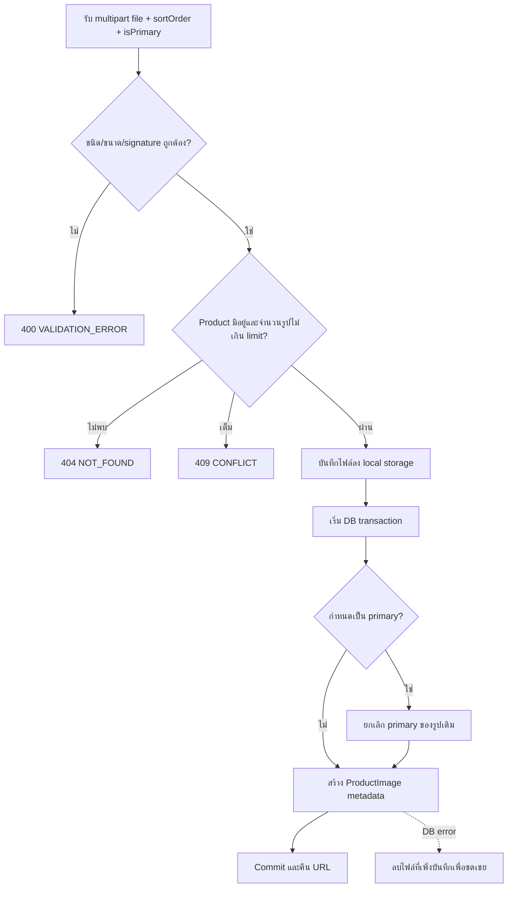
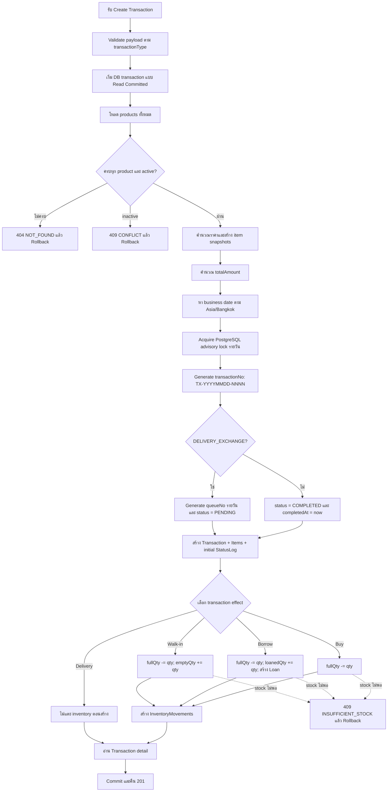
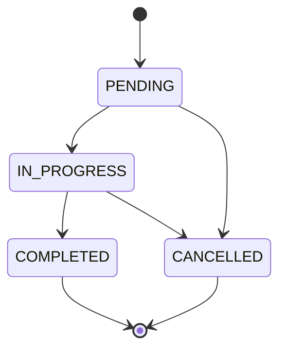
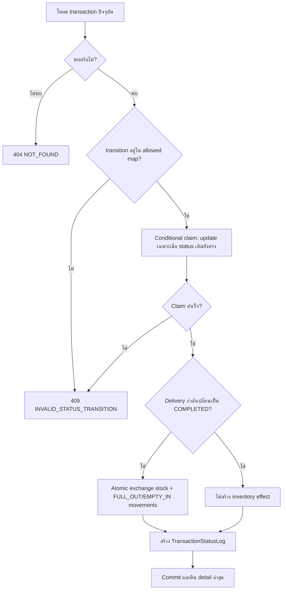
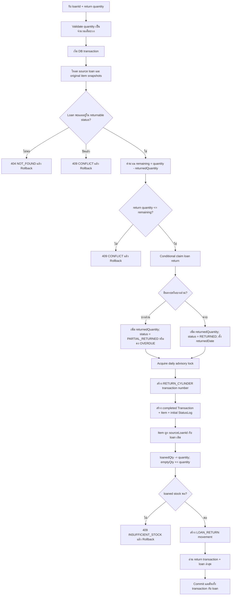
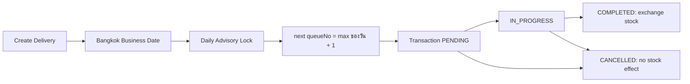
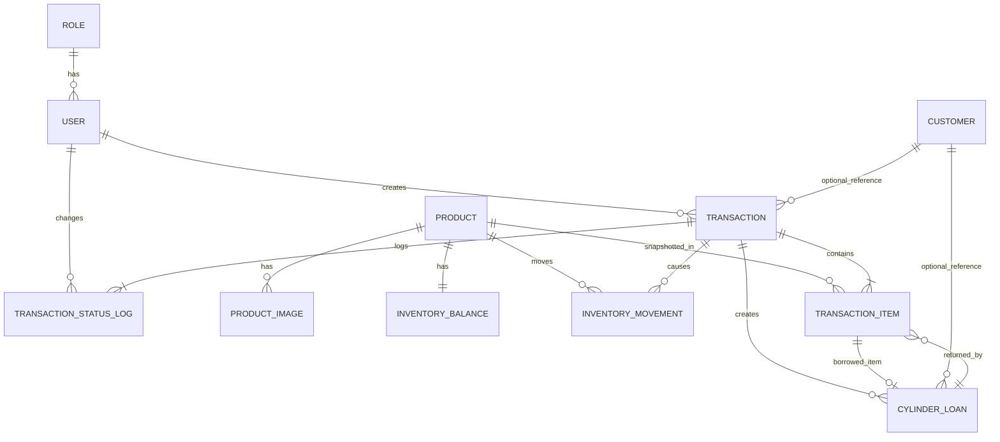

# KMG-SERVICE-API — Current API Workflow

> เอกสารฉบับนี้อธิบาย workflow ที่มีอยู่จริงใน source code ปัจจุบัน ณ วันที่ 23 กรกฎาคม 2026  
> จุดประสงค์หลักคือใช้เป็น source material สำหรับให้ ChatGPT หรือเครื่องมือสร้างภาพ แปลงเป็น system workflow diagram

## 1. ขอบเขตระบบที่ใช้งานได้ปัจจุบัน

KMG-SERVICE-API เป็น backend แบบ Modular Monolith สำหรับระบบจัดการร้านแก๊ส ใช้ Node.js, Express, TypeScript, Prisma และ PostgreSQL

API ทั้งหมดอยู่ใต้ `/api` และมีโมดูลที่เปิดใช้งานจริงดังนี้:

1. Authentication
2. Product Management
3. Product Image Management
4. Transaction Management
5. Cylinder Loan Management
6. Health Check

ส่วนที่มีข้อมูลหรือ business logic อยู่ภายในระบบ แต่ **ยังไม่มี public API แยกโดยตรง**:

- Queue: ข้อมูลคิวอยู่ใน transaction และสร้างอัตโนมัติสำหรับ `DELIVERY_EXCHANGE`
- Inventory: transaction และ loan workflow สามารถเปลี่ยน stock และสร้าง movement ได้ แต่ยังไม่มี list/adjustment endpoints
- Dashboard: ยังไม่มี module หรือ endpoint
- Customer: มี table และ relation รองรับ แต่ transaction ปัจจุบันบันทึก customer เป็น snapshot และยังไม่มี customer endpoints
- Users/Roles: ใช้ใน authentication/authorization แต่ยังไม่มี management endpoints

## 2. ผู้ใช้งานและสิทธิ์

ผู้ใช้งานหลักของ MVP คือ `ADMIN`

Role ที่เตรียม constant ไว้สำหรับอนาคต:

- `ADMIN`
- `STAFF`
- `RIDER`
- `ACCOUNTANT`

ปัจจุบัน Products, Transactions และ Loans อนุญาตเฉพาะ `ADMIN` ส่วน `/api/auth/me` ต้อง login แต่ไม่ได้บังคับว่าเป็น `ADMIN`

## 3. ภาพรวม End-to-End



ข้อยกเว้นของ pipeline:

- `GET /api/health` ไม่ต้อง login
- `POST /api/auth/login` validate body โดยตรงและไม่ต้อง login
- `GET /api/auth/me` ต้อง JWT authentication แต่ไม่ผ่าน ADMIN role guard
- Static product images เปิดผ่าน `/uploads/*`

## 4. Request และ Response Pipeline กลาง

ทุก request จะผ่านขั้นตอนต่อไปนี้:

1. สร้างหรือรับ `requestId`
2. บันทึก HTTP log โดย redact password, token และข้อมูลอ่อนไหว
3. ใช้ security headers จาก Helmet
4. ตรวจ CORS origin
5. Parse JSON โดยจำกัดขนาดที่ 1 MB
6. Match route ใต้ `/api`
7. Protected routes ตรวจ `Authorization: Bearer <JWT>`
8. Authentication middleware:
   - Verify JWT ด้วย server secret
   - อ่าน user ID จาก JWT subject
   - โหลด user และ role ล่าสุดจาก database
   - ปฏิเสธ user หรือ role ที่ inactive
9. Role middleware ตรวจว่า role เป็น `ADMIN` สำหรับ Products, Transactions และ Loans
10. Validate body, query หรือ params ด้วย Zod ตาม endpoint
11. Controller อ่าน validated input และเรียก service
12. Service ทำ business validation และกำหนด database transaction boundary
13. Repository ติดต่อ PostgreSQL ผ่าน Prisma
14. ส่ง standard success response หรือส่ง error เข้า global error middleware
15. Route ที่ไม่มีอยู่ส่ง `404 NOT_FOUND`

Success response:

```json
{
  "success": true,
  "data": {},
  "meta": {
    "requestId": "req_..."
  }
}
```

List response จะเพิ่ม pagination ใน `meta`:

```json
{
  "success": true,
  "data": {
    "resources": []
  },
  "meta": {
    "requestId": "req_...",
    "pagination": {
      "page": 1,
      "limit": 20,
      "totalItems": 0,
      "totalPages": 0
    }
  }
}
```

Error response:

```json
{
  "success": false,
  "error": {
    "code": "VALIDATION_ERROR",
    "message": "Invalid request payload",
    "details": []
  },
  "meta": {
    "requestId": "req_..."
  }
}
```

Error codes หลัก:

- `VALIDATION_ERROR`
- `UNAUTHORIZED`
- `FORBIDDEN`
- `NOT_FOUND`
- `CONFLICT`
- `INSUFFICIENT_STOCK`
- `INVALID_STATUS_TRANSITION`
- `INTERNAL_ERROR`

## 5. Endpoint Inventory

| Method | Endpoint | Auth | หน้าที่ |
| --- | --- | --- | --- |
| GET | `/api/health` | ไม่ต้องใช้ | ตรวจว่า API ทำงานอยู่ |
| POST | `/api/auth/login` | ไม่ต้องใช้ | Login และรับ JWT |
| GET | `/api/auth/me` | Bearer JWT | อ่านข้อมูล user ปัจจุบัน |
| GET | `/api/products` | ADMIN | แสดงสินค้าแบบ pagination/search |
| POST | `/api/products` | ADMIN | สร้างสินค้าและ inventory balance เริ่มต้น |
| GET | `/api/products/:productId` | ADMIN | ดูรายละเอียดสินค้า |
| PATCH | `/api/products/:productId` | ADMIN | แก้ข้อมูลหรือเปิด/ปิดสินค้า |
| DELETE | `/api/products/:productId` | ADMIN | Soft delete โดยตั้ง `isActive = false` |
| GET | `/api/products/:productId/images` | ADMIN | แสดงรูปของสินค้า |
| POST | `/api/products/:productId/images` | ADMIN | Upload รูป JPEG/PNG/WebP |
| PATCH | `/api/products/:productId/images/:imageId` | ADMIN | เปลี่ยนลำดับหรือรูปหลัก |
| DELETE | `/api/products/:productId/images/:imageId` | ADMIN | ลบ metadata และไฟล์รูป |
| GET | `/api/transactions` | ADMIN | ประวัติ transaction พร้อม filter/search |
| POST | `/api/transactions` | ADMIN | สร้าง transaction 4 ประเภทที่เปิด public |
| GET | `/api/transactions/:transactionId` | ADMIN | ดู transaction, items และ status logs |
| PATCH | `/api/transactions/:transactionId/status` | ADMIN | เปลี่ยนสถานะ transaction |
| POST | `/api/transactions/:transactionId/cancel` | ADMIN | ยกเลิก transaction |
| GET | `/api/loans` | ADMIN | แสดง loan ทั้งหมด |
| GET | `/api/loans/active` | ADMIN | แสดง loan ที่ยังมียอดค้าง |
| GET | `/api/loans/:loanId` | ADMIN | ดู loan และประวัติการคืน |
| POST | `/api/loans/:loanId/return` | ADMIN | คืนถังบางส่วนหรือทั้งหมด |

หมายเหตุ: `RETURN_CYLINDER` ไม่สามารถสร้างผ่าน `POST /api/transactions` โดยตรง ต้องผ่าน `POST /api/loans/:loanId/return` เท่านั้น

## 6. Authentication Workflow

### 6.1 Login — `POST /api/auth/login`

Input:

```json
{
  "username": "admin",
  "password": "admin1234"
}
```

Workflow:



ระบบไม่คืน `passwordHash` และใช้ข้อความ error เดียวกันสำหรับ username/password ผิด เพื่อลดการเปิดเผยข้อมูลบัญชี

### 6.2 Current User — `GET /api/auth/me`

1. อ่าน Bearer token
2. Verify JWT
3. อ่าน user ID จาก JWT subject
4. Reload user และ role จาก database
5. ถ้า user/role inactive หรือ token ผิด/หมดอายุ ให้ตอบ `401`
6. คืนข้อมูล user ปัจจุบัน

## 7. Product Workflow

### 7.1 List Products — `GET /api/products`

Query:

- `page`: default `1`
- `limit`: default `20`, สูงสุด `100`
- `search`: ค้นบางส่วนจาก brand แบบ case-insensitive
- `includeInactive`: default `false`

ผลลัพธ์เรียงจากสินค้าที่สร้างล่าสุด และมีรายการ images เรียงตาม `sortOrder`, `id`

### 7.2 Create Product — `POST /api/products`

ข้อมูลราคาเป็น string ทศนิยมไม่เกิน 2 ตำแหน่ง:

- `brand`
- `weightKg` ต้องมากกว่า 0
- `exchangeCostPrice`
- `exchangeSalePrice`
- `fullTankCostPrice`
- `fullTankPrice`

Workflow:



### 7.3 Update และ Deactivate Product

- `PATCH /api/products/:productId` แก้ field อย่างน้อยหนึ่ง field
- สามารถแก้ `isActive` เพื่อเปิดสินค้าเดิมกลับมาได้
- `DELETE /api/products/:productId` ไม่ลบ row แต่ตั้ง `isActive = false`
- สินค้า inactive ยังแสดงได้เมื่อใช้ `includeInactive=true`
- สินค้า inactive ห้ามนำไปสร้าง transaction ใหม่
- Transaction เก่ายังคง product/customer/price snapshots เดิมเสมอ

### 7.4 Product Image Workflow

กฎ:

- รับ field ชื่อ `file` แบบ multipart/form-data
- รองรับ JPEG, PNG และ WebP
- จำกัด 1 ไฟล์ต่อ request
- จำกัดขนาดตาม `PRODUCT_IMAGE_MAX_BYTES`
- จำกัดจำนวนรูปต่อสินค้าตาม `PRODUCT_IMAGE_MAX_COUNT`
- ตรวจทั้ง MIME type และ file signature จริง
- มี primary image ได้สูงสุดหนึ่งรูปต่อสินค้า
- รูปให้บริการเป็น static file ใต้ `/uploads`

Upload flow:



Update image สามารถเปลี่ยน `sortOrder` และ `isPrimary` ได้ ส่วน delete image จะลบ metadata ใน database ก่อน แล้วลบไฟล์จาก storage

## 8. Transaction Domain

### 8.1 Transaction Types

| Type | ความหมาย | Public create | สถานะเริ่มต้น | Inventory ตอนสร้าง |
| --- | --- | --- | --- | --- |
| `DELIVERY_EXCHANGE` | ส่งแก๊สและรับถังเปล่ากลับ | ใช่ | `PENDING` | ยังไม่เปลี่ยน |
| `WALK_IN_EXCHANGE` | แลกถังหน้าร้าน | ใช่ | `COMPLETED` | `FULL_OUT` + `EMPTY_IN` |
| `BORROW_CYLINDER` | ยืมถังเต็ม | ใช่ | `COMPLETED` | `LOAN_OUT` และสร้าง loan |
| `RETURN_CYLINDER` | คืนถังที่ยืม | ผ่าน Loan API เท่านั้น | `COMPLETED` | `LOAN_RETURN` |
| `BUY_FULL_TANK` | ซื้อถังเต็ม/ถังใหม่ | ใช่ | `COMPLETED` | `FULL_OUT` |

### 8.2 Item Actions

- Delivery และ Walk-in: `EXCHANGE`
- Borrow: `BORROW`
- Return: `RETURN`
- Buy full tank: `BUY_FULL_TANK`

### 8.3 Server-Owned Pricing

Client ส่งเพียง `productId`, `quantity` และ note ที่เกี่ยวข้อง แต่ไม่สามารถกำหนดราคาขาย/ทุนเอง

| Transaction Type | unitPrice snapshot | costPrice snapshot | lineTotal |
| --- | --- | --- | --- |
| Delivery/Walk-in Exchange | `exchangeSalePrice` | `exchangeCostPrice` | unitPrice × quantity |
| Buy Full Tank | `fullTankPrice` | `fullTankCostPrice` | unitPrice × quantity |
| Borrow Cylinder | `0.00` | `exchangeCostPrice` | `0.00` |
| Return Cylinder | `0.00` | cost snapshot จากรายการยืมเดิม | `0.00` |

`totalAmount` เป็นผลรวม `lineTotal` ที่ server คำนวณ

### 8.4 Snapshot Data

เมื่อสร้าง transaction ระบบเก็บ:

- customer name, phone, address snapshot
- product brand และ weight snapshot
- unit price, cost price, quantity และ line total snapshot
- item action

ดังนั้นการแก้ product ภายหลังจะไม่เปลี่ยนประวัติ transaction เดิม

## 9. Create Transaction Workflow

Endpoint: `POST /api/transactions`

กฎ input ร่วม:

- ต้องมี customer name
- ต้องมี item อย่างน้อย 1 รายการ
- quantity ต้องเป็นจำนวนเต็มบวก
- product ID ห้ามซ้ำกันภายใน transaction เดียว
- Delivery บังคับ customer address
- Borrow item เพิ่ม `expectedReturnDate` และ `depositAmount`
- Public schema ไม่รับ `RETURN_CYLINDER`

Core workflow ทั้ง 4 ประเภททำภายใน database transaction เดียว:



Transaction number และ queue number ใช้ daily advisory lock และ unique constraints เพื่อป้องกันเลขชนเมื่อมี concurrent requests ส่วน transaction runner retry write conflict ที่ retry ได้ สูงสุด 3 ครั้ง

## 10. Workflow แยกตาม Transaction Type

### 10.1 Delivery Exchange

Input สำคัญ:

- `transactionType = DELIVERY_EXCHANGE`
- customer name
- customer address บังคับ
- phone/note optional
- items

ผลตอนสร้าง:

- status = `PENDING`
- มี `queueDate` เป็นวันธุรกิจ Bangkok
- มี `queueNo` เริ่มจาก 1 ใหม่ในแต่ละวัน
- สร้าง initial status log: `null -> PENDING`
- ยังไม่ตัดถังเต็มและยังไม่รับถังเปล่าเข้าส stock

Status flow:



เมื่อ `IN_PROGRESS -> COMPLETED`:

1. Claim status แบบ conditional เพื่อกัน request ซ้ำ
2. ตรวจ full stock
3. `fullQty -= quantity`
4. `emptyQty += quantity`
5. สร้าง `FULL_OUT` movement
6. สร้าง `EMPTY_IN` movement
7. สร้าง status log
8. ตั้ง `completedAt`
9. Commit ทุกอย่างพร้อมกัน

ถ้า cancel จาก `PENDING` หรือ `IN_PROGRESS` จะสร้าง status log แต่ไม่เปลี่ยน inventory

### 10.2 Walk-in Exchange

เมื่อสร้าง:

1. status = `COMPLETED`
2. completedAt = เวลาปัจจุบัน
3. แต่ละสินค้า: `fullQty -= quantity`, `emptyQty += quantity`
4. สร้าง movement คู่ `FULL_OUT` และ `EMPTY_IN`
5. สร้าง initial status log: `null -> COMPLETED`
6. ไม่มี queue

ถ้า full stock ของสินค้าใดไม่พอ จะ rollback ทั้ง transaction

### 10.3 Borrow Cylinder

เมื่อสร้าง:

1. status = `COMPLETED`
2. totalAmount = `0.00`
3. แต่ละสินค้า: `fullQty -= quantity`, `loanedQty += quantity`
4. สร้าง `LOAN_OUT` movement
5. สร้าง `CylinderLoan` หนึ่งรายการต่อ transaction item
6. loan status เริ่มต้น = `BORROWED`
7. loan เก็บ customer/product snapshots, quantity, borrowed date, expected return date, deposit และ note
8. สร้าง initial transaction status log

ถ้า full stock ไม่พอ จะ rollback transaction, movement, balance และ loan ทั้งหมด

### 10.4 Buy Full Tank

เมื่อสร้าง:

1. status = `COMPLETED`
2. ใช้ full tank sale/cost prices
3. `fullQty -= quantity`
4. สร้าง `FULL_OUT` movement
5. สร้าง initial status log
6. ไม่มี `EMPTY_IN` เพราะไม่ได้แลกถัง
7. ไม่มี loan และไม่มี queue

## 11. Transaction Read Workflow

### 11.1 List — `GET /api/transactions`

รองรับ:

- pagination: `page`, `limit`
- filter: `transactionType`
- filter: `status`
- date range: `dateFrom`, `dateTo`
- search: transaction number, customer name หรือ phone

Date range ตีความเป็นขอบเขตวันตาม timezone `Asia/Bangkok` แล้วแปลงเป็น UTC สำหรับ query

ผลเรียง `createdAt DESC`, `id DESC` และ summary มี item count, total quantity, created by, queue, status และยอดรวม

### 11.2 Detail — `GET /api/transactions/:transactionId`

คืน:

- transaction/customer snapshots
- queue และ status
- price totals
- items และ product snapshots
- status logs เรียงตามเวลา
- created by, timestamps และ completedAt

Database IDs ถูก serialize เป็น string เพื่อหลีกเลี่ยงปัญหา JSON กับ BigInt

## 12. Change Status และ Cancel Workflow

Endpoints:

- `PATCH /api/transactions/:transactionId/status`
- `POST /api/transactions/:transactionId/cancel`

Allowed transitions:

- `PENDING -> IN_PROGRESS`
- `PENDING -> CANCELLED`
- `IN_PROGRESS -> COMPLETED`
- `IN_PROGRESS -> CANCELLED`

Final states:

- `COMPLETED`
- `CANCELLED`

Workflow:



ทุก status change ต้องมี status log ระบุ from, to, changedBy, changedAt และ note optional

## 13. Loan Read Workflow

### 13.1 List Loans — `GET /api/loans`

รองรับ:

- `page`, `limit`
- `status`
- `isOverdue=true|false`
- `search` จาก customer name, phone หรือ product brand snapshot

ผลเรียงจากรายการที่สร้างล่าสุด

### 13.2 Active Loans — `GET /api/loans/active`

แสดงเฉพาะ loan ที่:

- quantity มากกว่า returnedQuantity
- status เป็น `BORROWED`, `PARTIAL_RETURNED` หรือ `OVERDUE`

เรียง:

1. รายการ overdue ก่อน
2. expected return date ใกล้ที่สุดก่อน
3. borrowed date เก่าก่อน
4. loan ID

### 13.3 Overdue Calculation

`isOverdue` เป็นค่าที่คำนวณขณะอ่าน:

- ยังคืนไม่ครบ
- มี expected return date
- expected return date น้อยกว่าวันธุรกิจปัจจุบันใน Bangkok
- loan ไม่อยู่ใน final state

ดังนั้น record ที่เก็บ `loanStatus = BORROWED` หรือ `PARTIAL_RETURNED` อาจถูก response เป็น `isOverdue = true` ได้ โดยไม่ได้เปลี่ยน persisted status อัตโนมัติ

### 13.4 Loan Detail — `GET /api/loans/:loanId`

คืนข้อมูล summary พร้อม:

- original borrow transaction ID/item ID
- remaining quantity
- overdue flag
- return history

Return history แต่ละรายการอ้างถึง `RETURN_CYLINDER` transaction ที่สร้างตอนคืนถัง พร้อม transaction number, quantity, date, note และผู้ทำรายการ

## 14. Return Cylinder Workflow

Endpoint: `POST /api/loans/:loanId/return`

Input:

```json
{
  "quantity": 1,
  "note": "ลูกค้านำถังมาคืน"
}
```

การคืนบางส่วนและทั้งหมดใช้ endpoint เดียวกัน และทุกขั้นตอนสำคัญอยู่ใน database transaction เดียว



Concurrency protection:

- Conditional update ป้องกันการคืนเกินยอดค้าง
- ถ้ามี request อื่น claim ไปก่อน ระบบคืน `409 CONFLICT`
- Inventory update มีเงื่อนไข `loanedQty >= quantity`
- ถ้าขั้นตอนใดล้มเหลว loan, transaction, balance และ movement จะ rollback พร้อมกัน

## 15. Inventory Effects

Inventory แยกเป็น 3 balance ต่อสินค้า:

- `fullQty`: จำนวนถังเต็มในร้าน
- `emptyQty`: จำนวนถังเปล่าในร้าน
- `loanedQty`: จำนวนถังที่ลูกค้ายืมอยู่

| Movement | Balance effect | แหล่งที่เกิดในปัจจุบัน |
| --- | --- | --- |
| `FULL_OUT` | `fullQty -= quantity` | Exchange completion, Walk-in, Buy |
| `EMPTY_IN` | `emptyQty += quantity` | Exchange completion, Walk-in |
| `LOAN_OUT` | `fullQty -= quantity`, `loanedQty += quantity` | Borrow |
| `LOAN_RETURN` | `loanedQty -= quantity`, `emptyQty += quantity` | Loan return |
| `ADJUSTMENT` | เตรียม constant ไว้ แต่ยังไม่มี API | ยังไม่เปิดใช้งาน |

กฎสำคัญ:

- Balance update ใช้ conditional atomic SQL
- ห้ามให้ `fullQty` หรือ `loanedQty` ติดลบ
- ทุก inventory effect ที่เกิดจาก transaction ต้องสร้าง movement อ้างถึง transaction
- Multi-product request ถ้าสินค้าใด stock ไม่พอ ต้อง rollback ทั้งรายการ
- ไม่มี endpoint สำหรับแก้ balance โดยตรงในปัจจุบัน

## 16. Queue Workflow

Queue ไม่ได้มี table แยก แต่เก็บใน:

- `transactions.queueDate`
- `transactions.queueNo`

Queue เกิดเฉพาะ `DELIVERY_EXCHANGE`



ปัจจุบัน frontend สามารถอ่าน queue data ผ่าน Transaction list/detail เท่านั้น ยังไม่มี:

- `GET /api/queues`
- queue today/date endpoint
- queue-specific status endpoint

## 17. Database Transaction Boundaries

Workflow ต่อไปนี้เป็น atomic:

- Create Product + Initial Inventory Balance
- Upload image metadata และ primary-image switching
- Create Transaction + Items + Initial Status Log + Inventory Movements + Loans
- Change Transaction Status + Status Log + Delivery Inventory Effects
- Return Loan + Return Transaction + Item + Status Log + Balance + Movement

ถ้าเกิด error ภายใน boundary จะ rollback การเปลี่ยนแปลง database ทั้งหมด

ข้อสังเกตสำหรับ image storage: ตัวไฟล์อยู่ local filesystem ซึ่งไม่อยู่ใน PostgreSQL transaction ระบบจึงใช้ compensating delete เมื่อบันทึก metadata ไม่สำเร็จ

## 18. Data Relationship สำหรับวาดภาพ



ใน workflow ปัจจุบัน transaction และ loan ใช้ customer snapshot เป็นหลัก แม้ schema จะรองรับ optional `customerId`

## 19. Current-State Summary สำหรับสร้างภาพเดียว

ใช้โครงสร้างภาพแบบ swimlane หรือ left-to-right โดยแบ่ง lane ดังนี้:

1. **Admin Client**
   - Login
   - Manage Products/Images
   - Create Transactions
   - Change Delivery Status
   - View/Return Loans
2. **API Middleware**
   - Request ID
   - Logger/Security/CORS
   - Zod Validation
   - JWT Authentication
   - ADMIN Authorization
3. **Business Services**
   - AuthService
   - ProductService
   - TransactionService
   - LoanService
4. **Atomic Workflows**
   - Product + Initial Balance
   - Transaction + Status Log
   - Delivery Queue Number
   - Inventory Balance + Movement
   - Borrow Loan
   - Loan Return Transaction
5. **Persistence**
   - PostgreSQL
   - Local Image Storage
6. **Outputs**
   - Standard JSON Success/Error
   - Transaction History
   - Queue fields via Transactions
   - Loan and Return History

เน้นเส้นทาง transaction ด้วยสีแยก:

- Delivery Exchange: สีฟ้า — Pending → In Progress → Completed/Cancelled
- Walk-in Exchange: สีเขียว — Completed ทันที
- Borrow Cylinder: สีส้ม — Completed + Loan Out + Loan record
- Return Cylinder: สีม่วง — ผ่าน Loan API + Loan Return + Return history
- Buy Full Tank: สีแดง — Completed + Full Out

ใช้สัญลักษณ์ database transaction ครอบ workflow ที่แตะหลาย table และใส่ annotation ว่า:

- “All-or-nothing rollback”
- “No negative stock”
- “Every status change creates a status log”
- “Every stock change creates an inventory movement”
- “Historical data uses snapshots”
- “Business date uses Asia/Bangkok”

## 20. สิ่งที่ยังไม่ควรวาดว่าใช้งานได้แล้ว

เพื่อให้ภาพตรงกับระบบปัจจุบัน ไม่ควรแสดงสิ่งต่อไปนี้เป็น completed API:

- Queue list/management API แยก
- Inventory balance/movement list API
- Manual inventory adjustment API
- Dashboard summary API
- Customer CRUD API
- User/Role management API
- Payment gateway
- Delivery rider/GPS/route planning
- Notification ผ่าน LINE, SMS หรือ email
- Automatic job ที่ persist loan status เป็น `OVERDUE`

สิ่งเหล่านี้อาจแสดงในกรอบ “Future / Not Implemented” ได้ แต่ต้องไม่เชื่อมเหมือนเป็น production flow ที่เปิดใช้งานแล้ว

## 21. One-Paragraph Prompt สำหรับ Image Generator

สร้าง system workflow diagram ของ “KMG-SERVICE-API ระบบจัดการร้านแก๊ส” แบบ modern professional infographic อัตราส่วนกว้าง แบ่ง swimlane เป็น Admin Client, Express Middleware, Business Services, PostgreSQL/Storage และ API Response; แสดง Login ด้วย JWT, Product CRUD แบบ soft delete พร้อมสร้าง inventory balance, Product Image upload, Transaction 5 ประเภท โดย Delivery Exchange เริ่ม Pending มี daily queue และตัด stockเฉพาะตอน Completed, Walk-in Exchange completed ทันทีพร้อม Full Out และ Empty In, Borrow Cylinder completed ทันทีพร้อม Loan Out และสร้าง loan, Return Cylinder ต้องเริ่มจาก Loan API รองรับ partial/full return พร้อม Loan Return movement, Buy Full Tank completed ทันทีพร้อม Full Out; แสดง status flow PENDING → IN_PROGRESS → COMPLETED และ PENDING/IN_PROGRESS → CANCELLED; เน้นว่า multi-table workflow อยู่ใน database transaction, stock ห้ามติดลบ, stock ทุกครั้งมี inventory movement, status ทุกครั้งมี status log, transaction เก็บ customer/product/price snapshots และใช้วันตาม Asia/Bangkok; แยกกรอบ Future/Not Implemented สำหรับ Queue API, Inventory API, Dashboard, Customer CRUD และ User Management; ใช้สีฟ้าสำหรับ Delivery, เขียวสำหรับ Walk-in, ส้มสำหรับ Borrow, ม่วงสำหรับ Return และแดงสำหรับ Buy Full Tank พร้อม legend ที่อ่านง่าย

## 22. Source of Truth ที่ใช้จัดทำ

- `src/app.ts`
- `src/routes.ts`
- `src/middlewares/*`
- `src/modules/auth/*`
- `src/modules/products/*`
- `src/modules/transactions/*`
- `src/modules/loans/*`
- `src/constants/*`
- `src/database/prisma/schema.prisma`
- `CONTEXT.md`
- `Backend-Implement-Plan.md`
